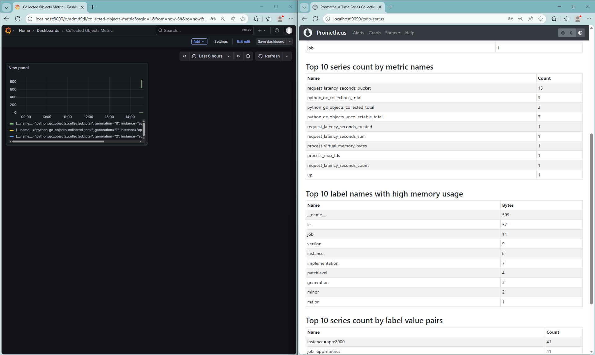
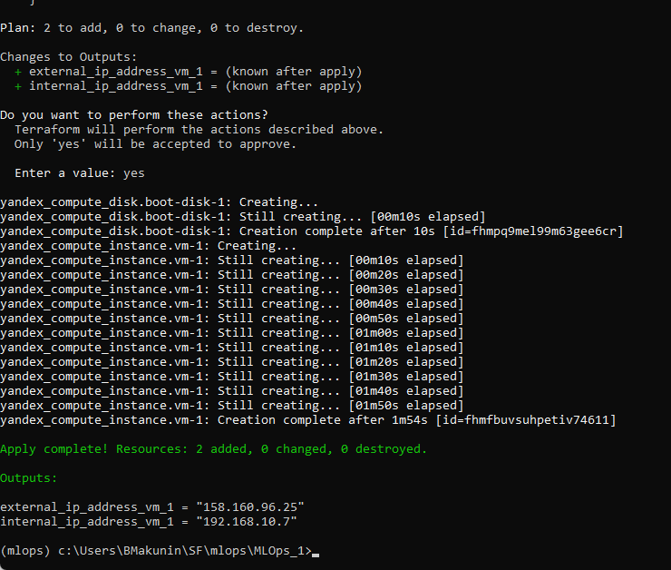
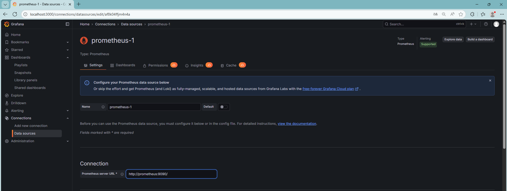

# Репозиторий с итоговым проектом по дисциплине «Автоматизация процессов доставки и развертывания моделей машинного обучения»

[Ссылка на репозиторий с первой частью](https://github.com/Boryan71/MLOps)

В рамках задачи по автоматизации процессов доставки и развертывания моделей машинного обучния реализована отказоустойчивая масштабируемая система с автоматизированной доставкой моделей и комплексным мониторингом.

В рамках проекта реализованы: 
* Все требования, обозначенные к первой части работы
* Создана нейросетевая модель классификации в формате ONNX, проведено [квантование](src/models/pipeline_nn.py), для уменьшения размера [модели NN_quant.onnx](models)
* Реализация [Terraform](./infrastruture/modules/network/main.tf) для развертывания в Yandex.Cloud
* Многостадийная сборка Docker-контейнера с интегрированным DVC для управления версиями данных.

## Инструкция по запуску
**1. Клонируем репозиторий**  
``` bash
git clone https://github.com/Boryan71/MLOps_1.git
```
**2. Вызываем запуск DVC-пайплайна для валидации данных и контроля выполнения всех шагов:**  
``` bash
dvc repro -f
```
3. **Docker-контейнер**:  

``` bash
docker-compose up --build
```  

Поднимаем Docker-приложение с контейнерами Prometheus, Grafana и обученной нейросетевой моделью.  




4. **Мониторинг дрифта**  
Отдельным [скриптом](./tests/monitoring/cd_monitoring.py) реализован мониторинг дрифта данных по метрике PSI, имитирующий поступление новых данных, переобучающий и переподнимающий модель при значительном отклонении.  
Вызов:  
``` bash
python src/features/cd_monitoring.py 
```

5. **Развертывание Terraform-конфигурации в Yandex.Cloud**  
(необходимо установить и настроить Terraform, в т.ч. добавить путь в Path + настроить провайдер Yandex.Cloud в %APPDATA%/terraform.rc)  
Вызов:  
```bash
terraform -chdir=./infrastructure/modules/network plan

terraform -chdir=./infrastructure/modules/network init

terraform -chdir=./infrastructure/modules/network apply
```

В результате в Yandex.Cloud разворачивается ВМ и подсеть с доступом через внешний IP:  


## Обзор реализованных функций
### Валидация данных при помощи GreatExpectations (Первая часть проекта)  
Для валидации входных данных реализован набор правил GreatExpectations в скрипте [validation.py](./src/data/validation.py).

### Построение и автоматизированная настройка модели через Sklearn Pipeline с подключенным логированием MLflow Tracking (Первая часть проекта)  
Создание модели выполнено в виде пайплайна Sklearn Pipeline, который включает в себя этапы предобработки и обучения.
Для логирования метрик модели используется MLflow Tracking, а также сохранение данных в JSON-файл.  
Данный шаг организован в скрипте [pipeline.py](./src/models/pipeline.py)

### Построение и настройка нейросетевой модели через Sklearn Pipeline, конвертация в ONNX и квантование.  
Создание нейросетевой модели, конвертация в формат ONNX, сравенение инференса обычной модели и нейросетевой, последующее квантование нейросетевой модели для уменьшения объема.   
Данный шаг организован в скрипте [pipeline_nn.py](./src/models/pipeline_nn.py)

### DVC-пайплайн (Первая часть проекта)  
Для автоматизированного контроля данных и моделей, а также учета зависимостей выполнения python-скриптов, реализован [DVC-пайплайн](./dvc.yaml).  

Для запуска пайплайна в корне проекта используется команда:  
 
``` bash
dvc repro
```


### GitHub Actions
При пуше изменений в репозиторий запускается CI-пайплайн проверки с помощью [GitHub Actions](./.github/workflows/ci_cd.yml).
Внутри пайплайна реализованы проверки линтинга с помощью flake8 и форматирования основных python-скриптов с помощью black, а также валидация тестовых данных с помощью набора правил GreatExpectations.
В дополненной версии реализованы проверки _safety_ и _bandit_.
Для прохождения проверки _safety_ необходима масшатбная перестройка проекта, так как ей не нравятся "устаревшие" пакеты.

Для ручной проверки необходимо вызвать из корня проекта следующие команды:

``` bash
flake8 --max-line-length=125 src
black --check src
bandit -r src

# Посыпет ошибками
safety check --full-report
```

### Многостадийная контейнеризация приложения в Docker и вызов нейросетевой модели по REST API, сбор метрик в Prometheus и дашборды в Grafana.
Готовый проект упаковывается в Docker-контейнер путем многостайдийной сборки.  
В Docker-контейнер внедрен DVC для управления версиями данных.  
Настройки контейнеризации указаны в [Dockerfile](./Dockerfile) и [docker-compose](./docker-compose.yml).  
Контейнер считается запущенным при наличии в консоли следующей строки:

``` bash
app-1  | INFO:     Uvicorn running on http://0.0.0.0:8000 (Press CTRL+C to quit)
```

При помощи фреймворка [FastAPI](./src/api/app.py) реализована возможность получения предсказаний через POST-запрос к контейнеру с предоставлением данных о клиенте.
Пример запроса из CMD (Windows):

``` bash
curl -X POST http://127.0.0.1:8000/predict/ -H "Content-Type: application/json" -d @./data/tests/examle.json
```

При помощи Prometheus обеспечивается сбор статистики количества запросов к приложению и задержки ответов.
В Grafana в связке с Prometheus можно настроить дашборды с необходимыми метриками.

Доступ к Prometheus осуществляется по адресу `http://localhost:9090/tsdb-status`.  
Подключение Grafana к Prometheus осуществляется выбором Data Source `http://prometheus:9090`.  
