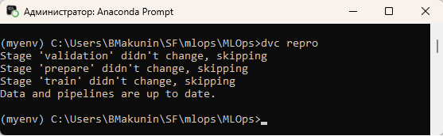
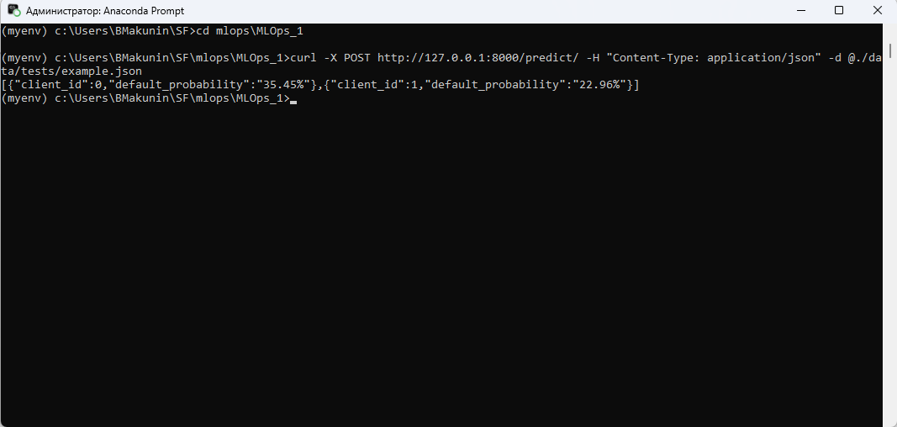

# Репозиторий с итоговым проектом по дисциплине «Автоматизация процессов разработки и тестирования моделей машинного обучения»

В рамках задачи по автоматизации процесса разработки и обслуживания PD-модели реализован end-to-end автоматизированный пайплайн разработки, тестирования, сборки и мониторинга модели машинного обучения, предсказывающей вероятность дефолта клиента.

В рамках проекта реализованы: 
* контроль версий кода в GitHub,
* скрипты для подготовки и валидации данных с использованием библиотеки GreatExpectations,
* Sklearn Pipeline для построения и настройки модели с автоматизированным подбором гиперпараметров с помощью библиотеки GridSearchCV,
* внедрен MLflow Tracking для записи и анализа различных сборок модели,
* для контроля версий данных и моделей огранизован DVC-пайплайн,
* настроен CI-пайплайн в GitHub Actions, включающий в себя проверку форматирования и линтинга с помощью библиотек black и flake8, а также проверка входных данных с помощью набора правил GreatExpectations,
* реализована контейнеризация приложения в Docker c возможностью обращения к обученной модели по REST API, для получения предсказания о вероятности дефолта клиента,
* отдельным скриптом реализован мониторинг дрифта обучающих данных, переподнимающий Docker-контейнер с моделью при значительных изменениях метрики PSI. 

## Обзор реализованных функций
### Валидация данных при помощи GreatExpectations
Для валидации входных данных реализован набор правил GreatExpectations в скрипте [validation.py](./src/data/validation.py).

### Построение и автоматизированная настройка модели через Sklearn Pipeline с подключенным логированием MLflow Tracking
Создание модели выполнено в виде пайплайна Sklearn Pipeline, который включает в себя этапы предобработки и обучения.
Для логирования метрик модели используется MLflow Tracking, а также сохранение данных в JSON-файл.  
Данный шаг организован в скрипте [pipeline.py](./src/models/pipeline.py)

### DVC-пайплайн
Для автоматизированного контроля данных и моделей, а также учета зависимостей выполнения python-скриптов, реализован [DVC-пайплайн](./dvc.yaml).

Для запуска пайплайна в корне проекта используется команда:  
 
``` bash
dvc repro
```



### GitHub Actions
При пуше изменений в репозиторий запускается CI-пайплайн проверки с помощью [GitHub Actions](./.github/workflows/ci_cd.yml).
Внутри пайплайна реализованы проверки линтинга с помощью flake8 и форматирования основных python-скриптов с помощью black, а также валидация тестовых данных с помощью набора правил GreatExpectations

Для ручной проверки необходимо вызвать из корня проекта следующие команды:

``` bash
flake8 --max-line-length=125 src
black --check src
```

### Контейнеризация приложения в Docker и вызов модели по REST API
Готовый проект упаковывается в Docker-контейнер. Настройки контейнеризации указаны в [Dockerfile](./Dockerfile) и [docker-compose](./docker-compose.yml).  
Контейнер считается запущенным при наличии в консоли следующей строки:

``` bash
app-1  | INFO:     Uvicorn running on http://0.0.0.0:8000 (Press CTRL+C to quit)
```

При помощи фреймворка [FastAPI](./src/api/app.py) реализована возможность получения предсказаний через POST-запрос к контейнеру с предоставлением данных о клиенте.
Пример запроса из CMD (Windows):

``` bash
curl -X POST http://127.0.0.1:8000/predict/ -H "Content-Type: application/json" -d "{\"LIMIT_BAL\": 20000,\"SEX\": 1,\"EDUCATION\": 2,\"MARRIAGE\": 1,\"AGE\": 24,\"PAY_0\": 2,\"PAY_2\": 2,\"PAY_3\": -1,\"PAY_4\": -1,\"PAY_5\": -2,\"PAY_6\": -2,\"BILL_AMT1\": 3913,\"BILL_AMT2\": 3102,\"BILL_AMT3\": 689,\"BILL_AMT4\": 0,\"BILL_AMT5\": 0,\"BILL_AMT6\": 0,\"PAY_AMT1\": 0,\"PAY_AMT2\": 689,\"PAY_AMT3\": 0,\"PAY_AMT4\": 0,\"PAY_AMT5\": 0,\"PAY_AMT6\": 0}"
```


## Инструкция по запуску
1. Вызываем запуск DVC-пайплайна для валидации данных и контроля выполнения всех шагов:
``` bash
dvc repro -f
```
2. При успешном прохождении всех проверок - поднимаем Docker-контейнер с обученной моделью:
``` bash
docker-compose up --build
```

В результате должны иметь работающий Docker-контейнер с обученной моделью предсказания вероятности дефолта клиента:



3. Отдельным [скриптом](./tests/monitoring/cd_monitoring.py) реализован мониторинг дрифта данных по метрике PSI, имитирующий поступление новых данных, переобучающий и переподнимающий модель при значительном отклонении.
Вызов:
``` bash
python src/features/cd_monitoring.py 
```
