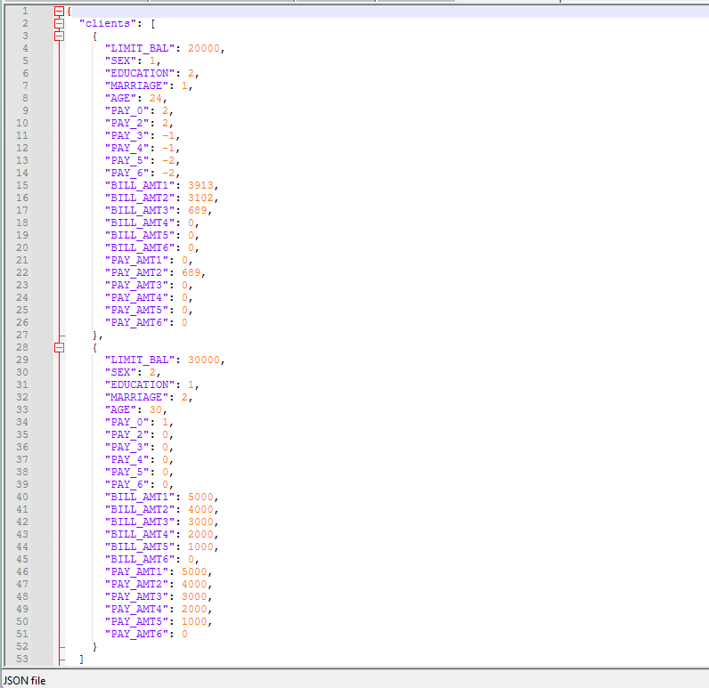
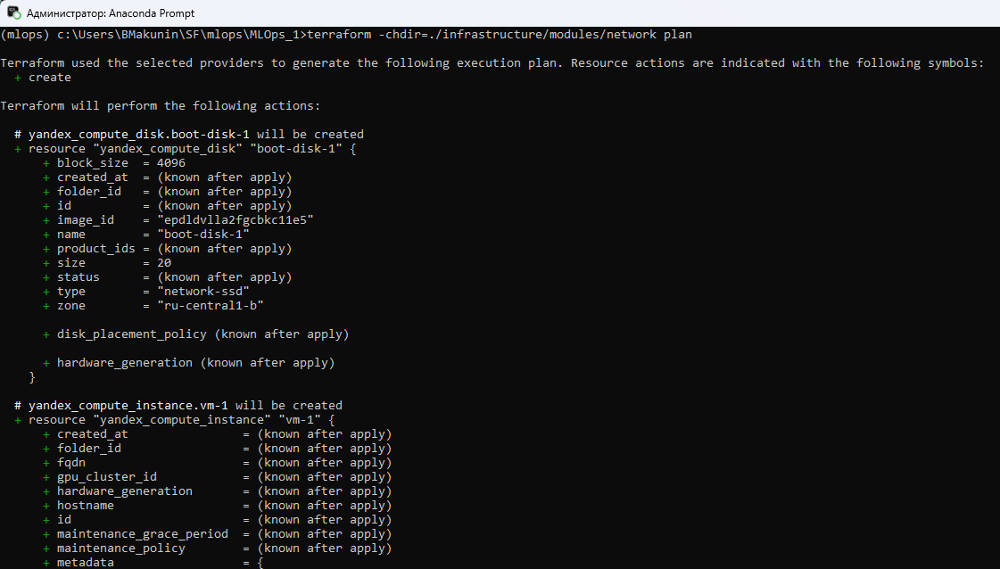

# Репозиторий с итоговым проектом по дисциплине «Автоматизация процессов доставки и развертывания моделей машинного обучения»

[Ссылка на репозиторий с первой частью](https://github.com/Boryan71/MLOps)

В рамках задачи по автоматизации процесса разработки и обслуживания PD-модели реализован end-to-end автоматизированный пайплайн разработки, тестирования, сборки и мониторинга модели машинного обучения, предсказывающей вероятность дефолта клиента.

В рамках проекта реализованы: 
* Все требования, обозначенные к первой части работы
* Создана нейросетевая модель классификации в формате ONNX, проведено [квантование](src/models/pipeline_nn.py), для уменьшения размера [модели NN_quant.onnx](models)
* **!В работе!** Реализация [Terraform](./infrastruture/modules/network/main.tf) для развертывания в Yandex.Cloud

## Инструкция по запуску
1. Вызываем запуск DVC-пайплайна для валидации данных и контроля выполнения всех шагов:
``` bash
dvc repro -f
```
2. При успешном прохождении всех проверок - поднимаем Docker-контейнер с обученной моделью:
``` bash
docker-compose up --build
```

В результате должны иметь работающий Docker-контейнер с обученной моделью предсказания вероятности дефолта клиента:




3. Отдельным [скриптом](./tests/monitoring/cd_monitoring.py) реализован мониторинг дрифта данных по метрике PSI, имитирующий поступление новых данных, переобучающий и переподнимающий модель при значительном отклонении.
Вызов:
``` bash
python src/features/cd_monitoring.py 
```

4. Развертывание Terraform-конфигурации в Yandex.Cloud (необходимо установить и настроить Terraform, в т.ч. добавить путь в Path + настроить провайдер Yandex.Cloud в %APPDATA%/terraform.rc)
Вызов:
```bash
terraform -chdir=./infrastructure/modules/network plan
```

В результате должно выдавать рабочий план развертывания terraform:  


## Обзор реализованных функций
### Валидация данных при помощи GreatExpectations (Первая часть проекта)
Для валидации входных данных реализован набор правил GreatExpectations в скрипте [validation.py](./src/data/validation.py).

### Построение и автоматизированная настройка модели через Sklearn Pipeline с подключенным логированием MLflow Tracking (Первая часть проекта)
Создание модели выполнено в виде пайплайна Sklearn Pipeline, который включает в себя этапы предобработки и обучения.
Для логирования метрик модели используется MLflow Tracking, а также сохранение данных в JSON-файл.  
Данный шаг организован в скрипте [pipeline.py](./src/models/pipeline.py)

### DVC-пайплайн (Первая часть проекта)
Для автоматизированного контроля данных и моделей, а также учета зависимостей выполнения python-скриптов, реализован [DVC-пайплайн](./dvc.yaml).

Для запуска пайплайна в корне проекта используется команда:  
 
``` bash
dvc repro
```


### GitHub Actions (Первая часть проекта)
При пуше изменений в репозиторий запускается CI-пайплайн проверки с помощью [GitHub Actions](./.github/workflows/ci_cd.yml).
Внутри пайплайна реализованы проверки линтинга с помощью flake8 и форматирования основных python-скриптов с помощью black, а также валидация тестовых данных с помощью набора правил GreatExpectations

Для ручной проверки необходимо вызвать из корня проекта следующие команды:

``` bash
flake8 --max-line-length=125 src
black --check src
```

### Контейнеризация приложения в Docker и вызов модели по REST API (Первая часть проекта)
Готовый проект упаковывается в Docker-контейнер. Настройки контейнеризации указаны в [Dockerfile](./Dockerfile) и [docker-compose](./docker-compose.yml).  
Контейнер считается запущенным при наличии в консоли следующей строки:

``` bash
app-1  | INFO:     Uvicorn running on http://0.0.0.0:8000 (Press CTRL+C to quit)
```

При помощи фреймворка [FastAPI](./src/api/app.py) реализована возможность получения предсказаний через POST-запрос к контейнеру с предоставлением данных о клиенте.
Пример запроса из CMD (Windows):

``` bash
curl -X POST http://127.0.0.1:8000/predict/ -H "Content-Type: application/json" -d @./data/tests/examle.json
```
